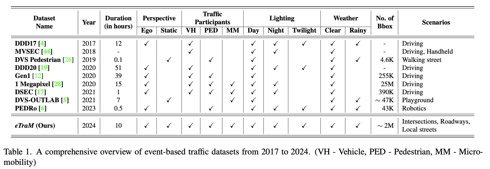
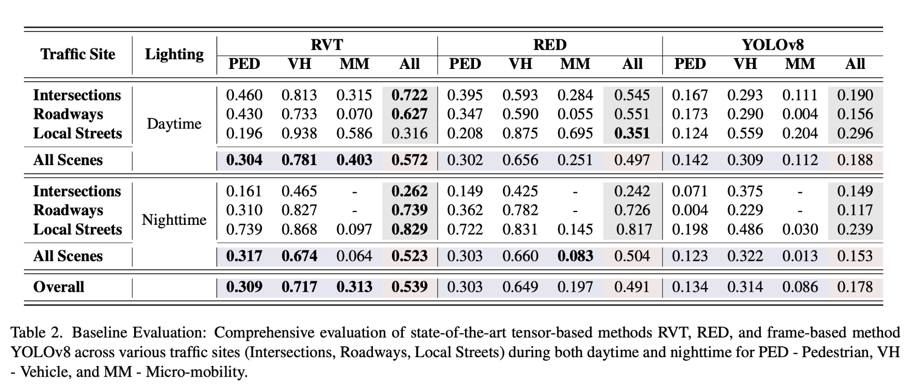

# Updates
- [29 April 2024] eTraM is now available in .h5 format as well.
- [29 April 2024] The pre-trained checkpoint of RVT-base is available for reference at [RVT](./rvt_eTram/README.md#pre-trained-checkpoint).

# *eTraM* : Event-based Traffic Monitoring Dataset 

<div>
<a href="https://openaccess.thecvf.com/content/CVPR2024/html/Verma_eTraM_Event-based_Traffic_Monitoring_Dataset_CVPR_2024_paper.html"> Paper</a> |
<a href="https://eventbasedvision.github.io/eTraM
/">Website</a> |
<a href="https://docs.google.com/forms/d/e/1FAIpQLSfH2LI5oqWWfose-pBC3dsbaAMvRQuv0BI93njV_5wQjYx83w/viewform">Data</a> |
<a href="https://eventbasedvision.github.io/eTraM/docs/eTraM%20Dataset%20Documentation.pdf" target="_blank">Doc </a>
</div>
<hr>


Event cameras, with their high temporal and dynamic range and minimal memory usage, have found applications in various fields. However, their potential in static traffic monitoring remains largely unexplored. To facilitate this exploration, we present eTraM - a first-of-its-kind, fully event-based traffic monitoring dataset. eTraM offers 10 hr of data from different traffic scenarios in various lighting and weather conditions, providing a comprehensive overview of real-world situations. Providing 2M bounding box annotations, it covers eight distinct classes of traffic participants, ranging from vehicles to pedestrians and micro-mobility. eTraM's utility has been assessed using state-of-the-art methods for traffic participant detection, including RVT, RED, and YOLOv8. We quantitatively evaluate the ability of event-based models to generalize on nighttime and unseen scenes. Our findings substantiate the compelling potential of leveraging event cameras for traffic monitoring, opening new avenues for research and application.



# Download 

The dataset can be downloaded using this [link](https://docs.google.com/forms/d/e/1FAIpQLSfH2LI5oqWWfose-pBC3dsbaAMvRQuv0BI93njV_5wQjYx83w/viewform).


# Dataset Overview

The dataset encompasses three distinct traffic monitoring scenes with 5 hr of intersection, 3 hr of roadway, and 2 hr of local street data sequences. Data for each scene is collected at multiple locations. For instance, the intersection scene contains data from 2 four-way, three-way, and an uncontrolled intersection. Each location has daytime, nighttime, and twilight data totaling up to 10 hr of data with 5 hr of daytime and nighttime data.

# Folder Structure
```sh
eTraM
├── LICENSE
├── imgs/
├── README.md
├── rvt_eTram/ # updated version of rvt for eTraM
└── ultralytics_eTram/ # updated version of ultralytivcs for eTraM
    └── yolo_eTram/ # scripts to run yolo
```

# Baseline

 </img>

The implementation of these models for eTraM can be found here.

[RVT](./rvt_eTram/) |
[YOLO](./ultralytics_eTram/yolo_eTram/) | 

# License

<a rel="license" href="http://creativecommons.org/licenses/by-sa/4.0/"></a><br />This work is licensed under a <a rel="license" href="http://creativecommons.org/licenses/by-sa/4.0/">Creative Commons Attribution-ShareAlike 4.0 International License</a>.

# Citation

```
@InProceedings{Verma_2024_CVPR,
    author    = {Verma, Aayush Atul and Chakravarthi, Bharatesh and Vaghela, Arpitsinh and Wei, Hua and Yang, Yezhou},
    title     = {eTraM: Event-based Traffic Monitoring Dataset},
    booktitle = {Proceedings of the IEEE/CVF Conference on Computer Vision and Pattern Recognition (CVPR)},
    month     = {June},
    year      = {2024},
    pages     = {22637-22646}
}
  ```
